# Sadat's Pizzeria Service(React/Laravel/Mailjet/Stripe)
A pizza ordering react and laravel app
## Features For react front-end
- Show pizza menu
- Allows admin to store pizza menu with image upload.
- Allows admin to edit pizza menu with image upload.
- Allows customers to order pizza while capturing their location(google maps geocoding), quantity, pizza type, total price.
- Connects to API to send pizza order fulfilment or cancellation emails via mailgun to customers.
- Authentication for Admin(login and logout).
- Connects to API to allow Administrators to fulfil or cancel order with notes and emails via mailgun.
- Allows users to enter credit/debit card via stripe integration for pizza order payments.

## Features For API
- Endpoint to return pizza menu
- Endpoint store pizza menu with image upload.
- Endpoint edit pizza menu
- Endpoint take location, quantity, pizza type, toatl price as a pizza order
- Endpoint that takes in pizza order fulfilment or cancellation emails via mailgun to customers.
- API to Authenticate Admin login and logout
-  Endpoint to allow Administrators to fulfil or cancel order with notes and emails via mailgun.
- take in credit/debit card payments via stripe integration.

## Installation for frontend

In the project directory, you can run:

### `npm install`
### `set up configs(API URL, stripe and googlemaps API) in src/Helpers/Url.js
### `npm start`


## Prerequisites for API
- Docker/Docker Compose
- [All Laravel Dependencies](https://laravel.com/docs/7.4#server-requirements)

## Installation for API
* Clone the Repository
* Set up your .env
    - Configuring the docker database

Build the images and start the services:
```
docker-compose build --no-cache pizzeria-api
docker-compose up -d
```

## Helper scripts
Running `composer`, `php artisan` or `phpunit` against the `php` container with helper scripts in the main directory:

### container
Running `./container` takes you inside the `pizzeria-api` container under user uid(1000) (same with host user)
```
$ ./container
devuser@8cf37a093502:/var/www/html$
```
### db
Running `./db` connects to your database container's daemon using mysql client.
```
$ ./db
mysql>


## Troubleshooting
If you happen to have issues after installing try to

- Install dependencies with composer if the vendor folder doesn't exist or errors related to dependencise are thrown
- Clear config, cache, view and route caches with artisan commands
- Modify permissions for the storage and bootstrap directories
```
<h2 id="screenshots">Customer Screenshots</h2>

<h6> Customer pizza menu </h6>

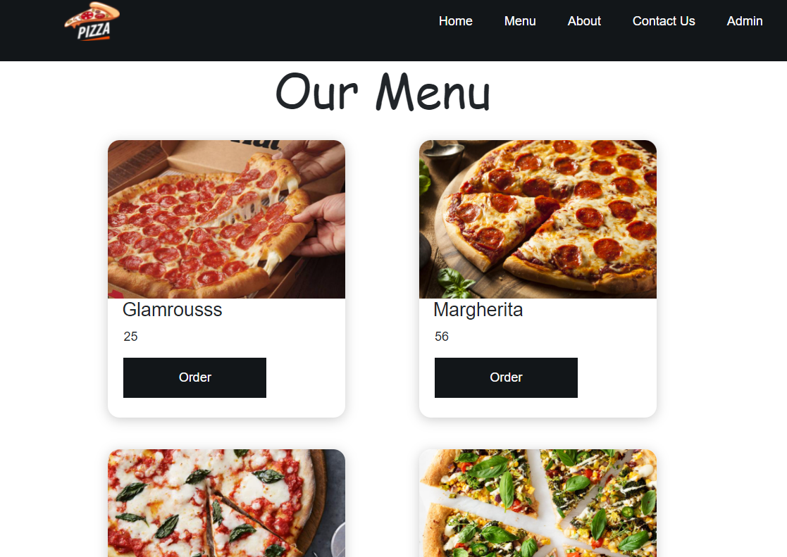

<h6> Customer clicks to order a pizza </h6>

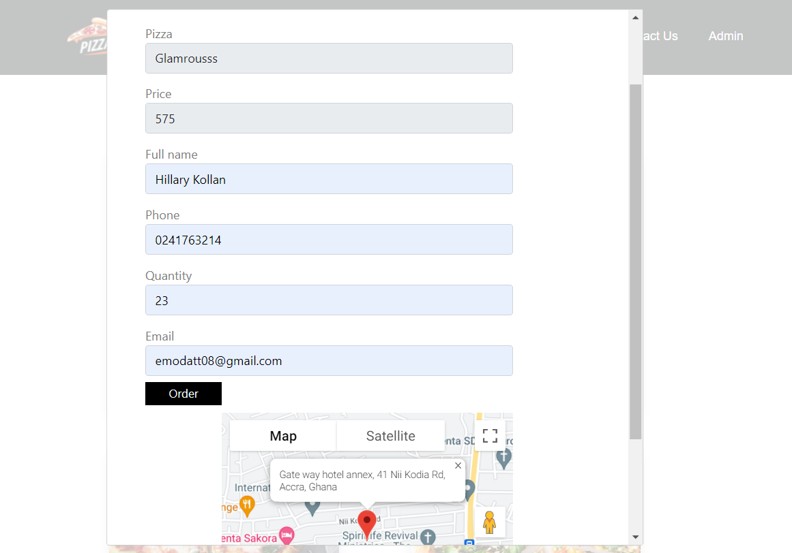

<h6> Customer proceeds to make payment via stripe </h6>

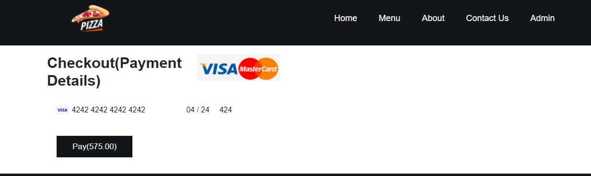

<h6> Customer payments recorded on stripe </h6>

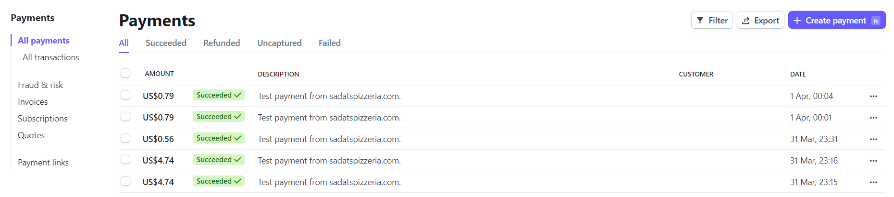


<h2 id="screenshots">Admin Screenshots</h2>

<h6> Admin login page </h6>

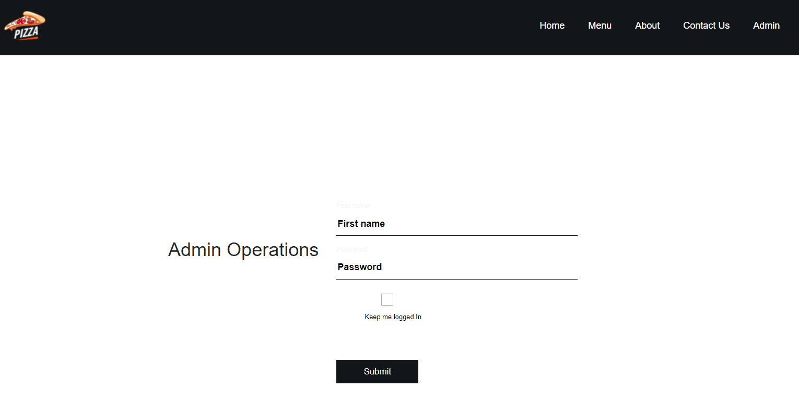

<h6> Admin sees all pizza orders </h6>

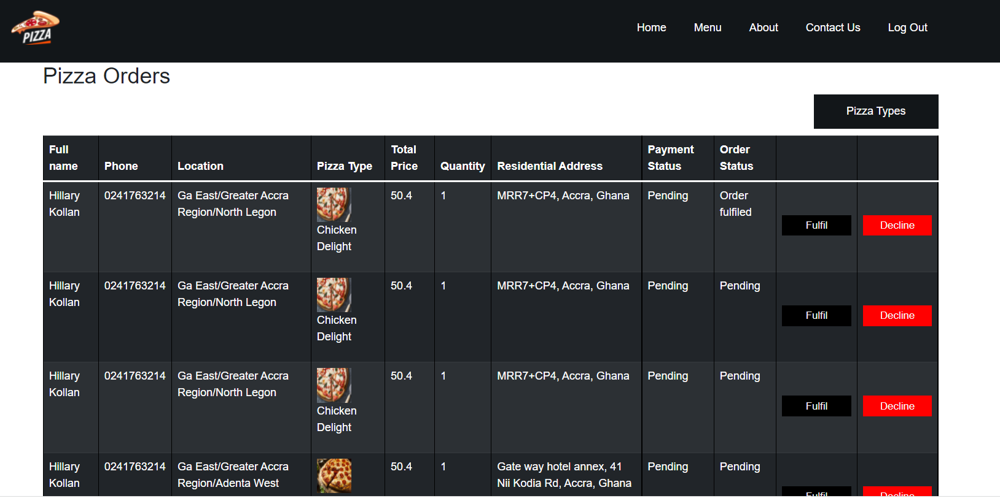

<h6> Admin fulfils order </h6>

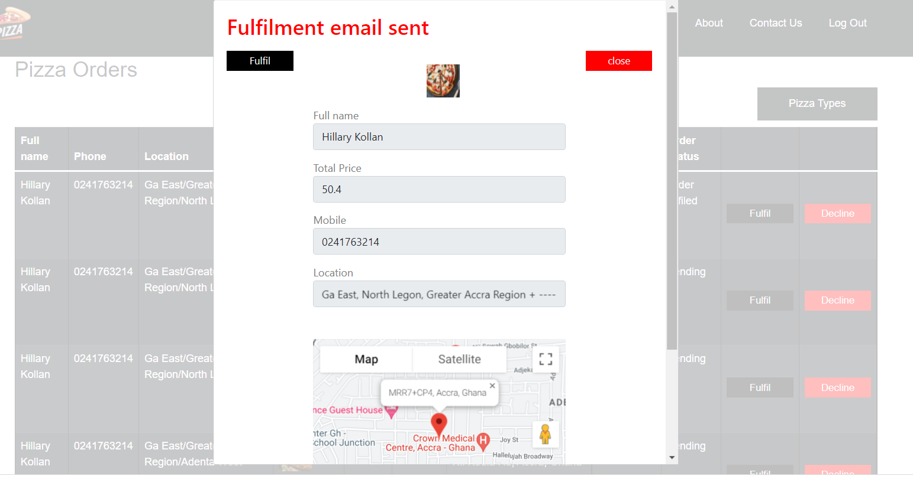

<h6> Fulfilment email sent </h6>

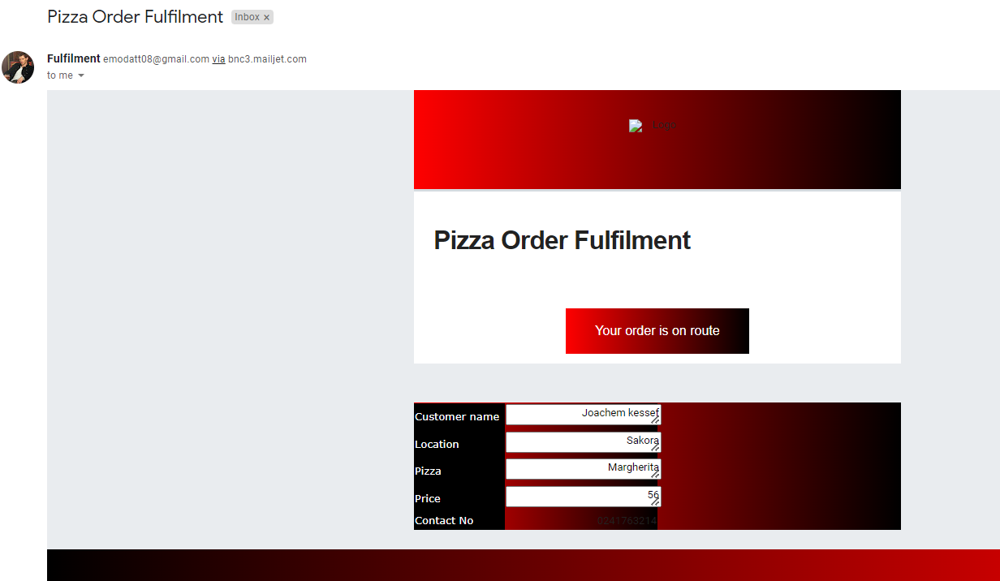

<h6> Admin declines order with reason </h6>

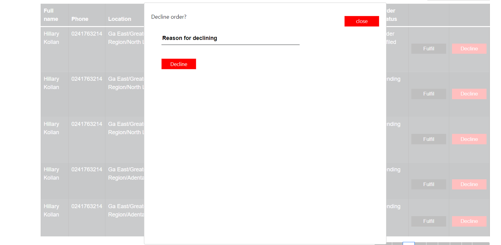

<h6> Declinement email sent with reason </h6>

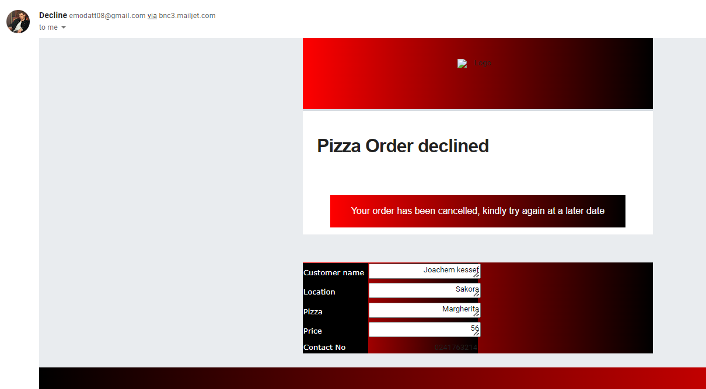

<h6> Admin adds pizza type with pizza image </h6>

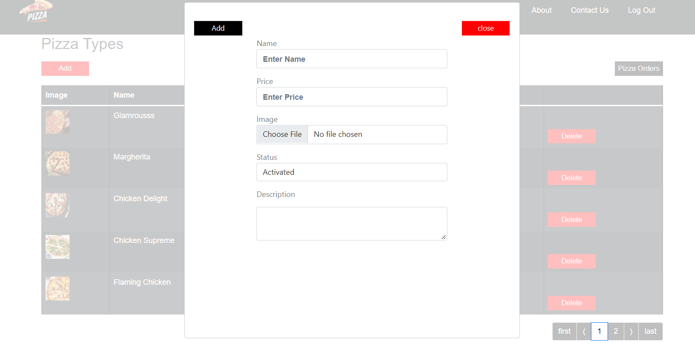

<h6> Admin edits pizza type with pizza image </h6>

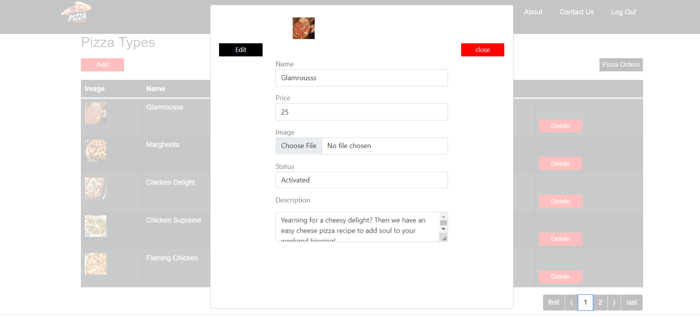
